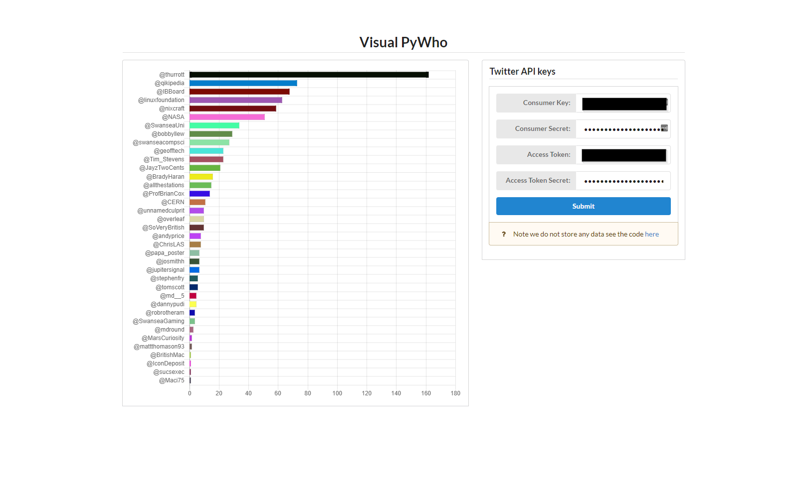

# Visual PyWho

Based on the code from @IBBoard https://dev.ibboard.co.uk/repos/other/WhoTweets/file/b2ff4e4d4085


Wraps the main fuction in a tornado server in a post request. User sends the server twitter api details and a chart will be generated as seen below





Docker file also avalible because why not


``` docker build -t pywho . ```

``` docker run -p 8888:8888 pywho ```


